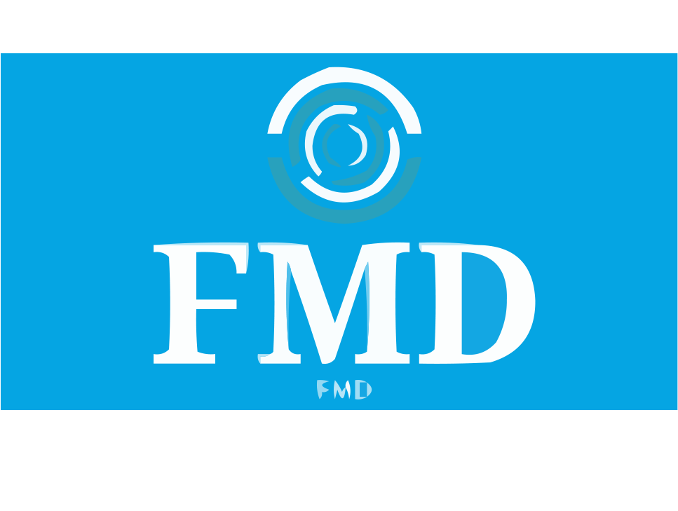
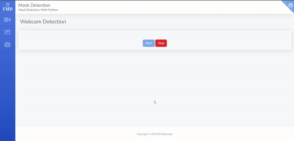
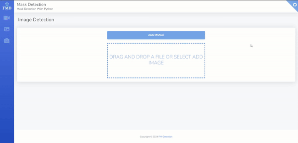

# FM Detection - Face Mask Detection




[](https://github.com/mojikarimi/FM-Detection/stargazers)
[](https://github.com/mojikarimi/FM-Detection/network)
[](https://github.com/mojikarimi/FM-Detection/issues)
[](https://github.com/mojikarimi/FM-Detection/blob/main/LICENSE)
[](https://github.com/mojikarimi/FM-Detection/pulls)
[]https://github.com/mojikarimi/FM-Detection/commits/main)

Masks play an important role in protecting people’s health from respiratory diseases, as they are one of the few
precautions available for COVID-19 in the absence of immunization. Using this NoteBook, a model can be created to
identify people who use masks, do not use them, or use inappropriate masks.

## Table of Contents:

- [Introduction](#introduction)
- [Features](#features)
- [Examples](#examples)
- [Installation](#installation)
- [Contributing](#contributing)
- [License](#license)
- [Contact](#contact)

## Introduction:

In this repo, using different technologies such as django and deep learning, a deep learning model for facial mask
recognition has been implemented using CNN algorithm.

#### Django:

[`Django`](https://www.djangoproject.com/) is a high-level Python web framework that encourages rapid development and
clean, pragmatic design. Built by experienced developers, it takes care of much of the hassle of web development, so you
can focus on writing your app without needing to reinvent the wheel. It’s free and open source.

#### CNN:

A [`Convolutional Neural Network (CNN)`](https://www.datacamp.com/tutorial/introduction-to-convolutional-neural-networks-cnns),
also known as ConvNet, is a specialized type of deep learning algorithm mainly designed for tasks that necessitate
object recognition, including image classification, detection, and segmentation. CNNs are employed in a variety of
practical scenarios, such as autonomous vehicles, security camera systems, and others.

## Features:

* **Mask recognition in video, image**: Easily recognize faces with and without masks by uploading your video and help
  maintain the health of society.

* **Detecting masks in real time**: using a webcam, you can determine whether the person in question is wearing a mask
  or not, and ensure the health of your community and family.

* **Using a beautiful user interface**: using [`Django`](https://www.djangoproject.com/) and front-end technologies such
  as [`HTML`](https://www.w3schools.com/html/), [`CSS`](https://developer.mozilla.org/en-US/docs/Web/CSS),
  and [`JS`](https://developer.mozilla.org/en-US/docs/Web/JavaScript) to make it easier to work with the model
  recognition algorithm.

* **Model training**: Train your model using cnn algorithm and use our very good dataset.

* **Familiarity with today's technologies**: build your model using [`Django`](https://www.djangoproject.com/) and
  Python libraries such as [`opencv`](https://opencv.org/) and [`tensorflow`](https://www.tensorflow.org/) and present
  it to the community in the form of a site.

## Examples:

1. ### Webcam Detection:



2. ### Video Detection:


3. ### Image Detection:



## Installation:

To deploy [`FM-Detection`](https://github.com/mojikarimi/FM-Detection) on your local machine, follow these simple steps:

1. **Clone the Repository**: Clone this repository to your local machine using the following command:

```
git clone https://github.com/mojikarimi/FM-Detection.git
```

2. **Install Dependencies**: Navigate to the project directory and install the required dependencies:

```
cd FM-Detection
pip install -r requirements.txt
```

3. **Train model**: Go to the Train-Model directory and run the existing notebook and place the output model in the
   following path.

**Hint:** Train the model according to the instructions in the notebook file and place the data set paths correctly.

```
DL_Detection/model/
``` 

4. **Apply Migrations**: Apply Django migrations to set up the database schema:

```
python manage.py makemigrations
python manage.py migrate
```

5. **Run the Development Server**: Launch the development server to start TaskPyTrack:

```
python manage.py runserver
```

6. **Access FM-Detection**: Open your web browser and visit http://127.0.0.1:8000/ to access the FM-Detection
   application.

7. **Start recognizing and working with the model**: photos, videos, or even by turning on your webcam, start working
   with the model and recognize masked and unmasked faces.

## Contributing:

FM-Detection welcomes contributions from the community! If you're interested in contributing, please follow these
guidelines:

1. **Fork the Repository**: Fork the FM-Detection repository on GitHub.
2. **Create a New Branch**: Create a new branch for your feature or bug fix.
3. **Make Changes**: Implement your changes, ensuring they adhere to the project's coding standards.
4. **Test Your Changes**: Run tests to ensure your changes haven't introduced any regressions.
5. **Submit a Pull Request**: Once your changes are ready, submit a pull request, providing a detailed description of
   your changes.

## License:

FM-Detection is licensed under the [`MIT License`](https://github.com/mojikarimi/FM-Detection/blob/main/LICENSE). See
the LICENSE file for details.

## Contact:

For any inquiries, feedback, or support requests, please don't hesitate to reach out to the project maintainer at
moji.k1381@gmail.com


## Resources:

Template: [`TaskPyTrack`](https://github.com/farzadasgari/TaskPyTrack)

